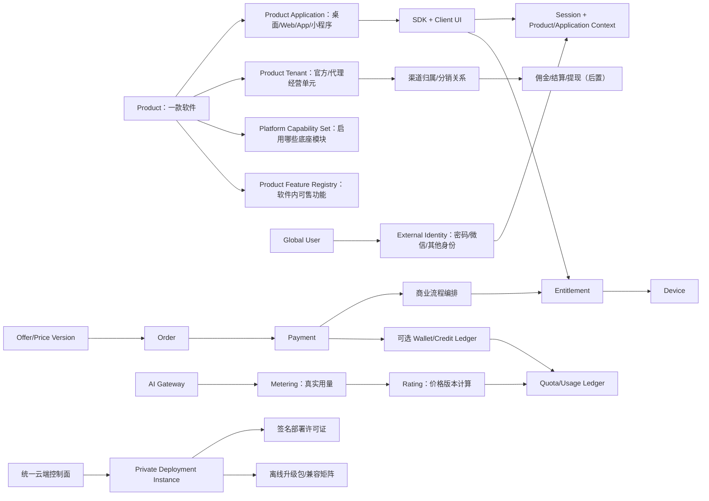

# 软件商业化统一底座能力完整性审计

- 审计日期：2026-07-13
- 审计性质：产品能力、模块边界与落地顺序审计
- 审计范围：`product-scope.md`、`ai-development-map.md`、`capability-index.md`、`roadmap.md`、全部 ADR、全部 `docs/features/` 契约及用户前台契约
- 结论状态：架构方向正确；初审发现的 6 个关键关系均已完成 ADR 或契约封口，生产实现仍按路线图逐段验收

## 1. 总结结论

当前设计已经抓住了真正应该统一的核心：多产品上下文、统一账号、权益、设备、激活码、商品订单、支付、AI Gateway、用量、版本、配置、存储、代理租户、SDK 和多端用户前台。模块化单体、契约优先、服务端解析 `product_id + tenant_id`、逻辑 AI 模型与不可变价格版本等决策也适合长期由 AI 参与开发。

初审时“能力名单”明显领先于“可执行契约”。截至 2026-07-13，product、product-application、tenant、identity、entitlement、device、license、catalog、order、payment、commerce、ai-gateway、usage、deployment、access-control、audit 已具有 README、contract 和 move-guide；release、config、storage、notification、analytics 等后续模块仍保持 planned，不允许 AI 自行补全为生产实现。

最重要的调整不是继续增加菜单，而是固定以下六个关系。当前封口状态如下：

1. 平台能力开关、付费功能权益、软件运行时功能开关是三种不同事实。
2. 套餐商品、订单支付、权益授予和按量计费需要两条明确但可汇合的商业链路。
3. Product 下面还需要明确“客户端应用/渠道”，才能正确覆盖桌面、Web、App 和小程序。
4. 微信等联合登录必须包含账号绑定与合并，不能只在登录页增加一个按钮。
5. 私有部署实例及其离线授权不是代理 Tenant，也不是普通激活码。
6. AI 用量账本不应同时承担充值资金、佣金和支付余额的职责。

| 初审问题 | 当前状态 | 固化证据 |
|---|---|---|
| 三种能力/功能概念混淆 | 已封口 | `domain-language.md`、product/catalog/entitlement 契约 |
| 商品、订单、支付、权益缺少流程所有者 | 已封口 | ADR-0008、commerce 契约 |
| Product 缺少多端 ApplicationContext | 已封口 | ADR-0006、product-application 契约 |
| 微信/OIDC 只登录不处理绑定合并 | 已封口 | identity 契约、ST-022 |
| 私有部署与 Tenant/激活码混淆 | 已封口 | ADR-0007、deployment 契约、ST-023 |
| 用量、额度、余额、佣金混账 | 已封口 | ADR-0005、usage 契约；Wallet/Settlement 明确后置 |

“已封口”只表示关系、所有权与接口语义已经确定，不表示后端、数据库、Provider 或端到端流程已经实现。

## 2. 建议采用的总关系图



这里有五个不能混用的范围：

| 范围 | 回答的问题 | 典型字段 |
|---|---|---|
| Product | 这是哪一款软件 | `product_id` |
| Product Application | 这是该软件的哪个端和渠道 | `application_id`、platform、channel |
| Tenant | 这笔经营与数据归属于官方还是某代理 | `tenant_id` |
| User/Organization | 谁在使用 | `user_id`，未来可选 `organization_id` |
| Deployment Instance | 这套系统部署在哪个客户环境 | `deployment_id` |

## 3. P0：编码前必须解决的问题

### P0-1：区分三种“能力/功能开关”

当前 product capability、catalog features、entitlement features 和 config 功能开关容易被 AI 当成同一概念。

建议固定为：

| 概念 | 权威模块 | 示例 | 变化影响 |
|---|---|---|---|
| 平台能力 `capability_id` | product | 该软件是否接入支付、AI Gateway、存储 | 决定后台菜单和 API 是否存在 |
| 产品功能 `feature_code` | 产品功能注册表 + entitlement | 用户是否有批量导出、高清生成 | 决定某个用户可使用什么 |
| 运行时配置 `config_key` | config | 新首页灰度、客服二维码、紧急熔断 | 决定软件行为或内容，不产生会员权益 |

必须在 catalog、entitlement 和 config 的契约中禁止彼此成为事实来源。

### P0-2：补齐商业链路的唯一事实来源

当前主链路方向正确，但缺少一个明确的跨模块流程所有者。建议保留领域事实分散在各自模块，由“Commerce Process Manager/应用流程编排”消费事件并推进：

```text
OfferVersion -> Order -> Payment confirmed
-> Order completed -> Entitlement granted

Refund confirmed -> Order refund applied
-> Entitlement revoked/adjusted
```

编排器不拥有订单、支付或权益数据，只保存流程进度和幂等状态。否则 payment、order 和 entitlement 会互相调用并形成环依赖。

还需明确：

- Catalog 的价格版本和商品快照不可改写。
- Payment 只记录资金渠道事实，不直接授予权益。
- Order 决定买了什么，但不验证 Provider 回调。
- Entitlement 只接受可信来源授予，不查询订单表。
- 退款必须定义部分退款、全额退款、权益回收失败和人工复核路径。

### P0-3：在 Product 下增加 Application/Surface 概念

同一款软件可能同时有 Windows、macOS、Web、H5、Android、iOS、微信小程序，甚至多个微信 AppID。仅有 `product_clients` 和 `client_version` 不足以表达登录、支付、回跳和发布差异。

建议 Product 模块拥有：

```text
product_applications
  application_id
  product_id
  platform: windows | macos | web | h5 | android | ios | wechat_miniprogram
  distribution_channel
  auth_profile_ref
  payment_profile_ref
  redirect/deep-link allowlist
  status
```

它不是新租户，也不产生新的会员权益；它只是同一 Product 的客户端表面和渠道上下文。

### P0-4：把联合登录建模为身份绑定

Identity 当前契约只有密码登录。微信登录在 Web 扫码、小程序、公众号和 App 下使用不同标识；`openid` 还与 AppID 相关。必须设计：

- `external_identities(provider, provider_app, subject)` 唯一绑定。
- 微信 UnionID 可用时的账号关联规则，以及没有 UnionID 时的处理。
- 已登录绑定、解绑、换绑和凭据泄露后的撤销。
- “微信身份已属于另一个账号”时的人工可理解恢复流程。
- 手机号/邮箱/微信首次登录如何创建或合并全局 User。
- OAuth/OIDC 的 state、nonce、PKCE、回调白名单与一次性扫码状态。

这一能力应进入 Identity 第一阶段契约，否则各端会各写一套用户创建逻辑。

### P0-5：私有部署必须是独立模块

用户明确需要“独立部署给客户并授权”。它不能复用代理 Tenant：Tenant 表示云平台中某产品的经营隔离，Private Deployment 表示一套独立运行实例。

建议新增 `deployment` 与 `deployment-license` 设计，至少覆盖：

- 客户、产品、部署实例、环境、版本和实例指纹。
- 签名许可证：期限、功能、席位/节点/并发限制、离线宽限。
- 在线激活、离线申请文件、离线许可证导入、换机和吊销。
- 空气隔离环境的安装包、迁移包、升级包和兼容矩阵。
- 备份恢复、数据导出、支持诊断包、密钥轮换和退役。
- 遥测是否允许必须由客户配置；私有数据默认不回传。
- 控制面失联不应立即导致客户生产系统停摆。

普通 `license_codes` 继续服务最终用户激活码；部署许可证使用非对称签名证书，两者不可共表或共用验证流程。

### P0-6：拆清“用量、额度、余额、账单”

Usage 契约写明“不负责支付余额”，但能力索引中的 `usage.record` 输出“余额”，职责已经出现冲突。

建议内部至少分为四个子域，即便初期仍放在同一 Go 模块：

| 子域 | 事实 |
|---|---|
| Metering | Provider 或业务产生了多少真实用量 |
| Rating | 按哪个不可变价格版本计算成本和售价 |
| Quota | 允许使用多少、预占多少、还剩多少 |
| Ledger | 发生了哪些不可改写的增减流水 |

如果未来允许用户充值余额、购买点数包或代理预存款，再增加独立 Wallet/Credit Ledger。不要把可退款资金余额伪装成会员权益，也不要把代理佣金塞进 Usage Ledger。

## 4. P1：高优先级通用能力缺口

### 4.1 订阅与会员生命周期

“月付、年付”不等于已经支持 Subscription。至少要明确第一版是单次续费还是自动续费。自动续费还需要协议签约、扣款重试、宽限期、取消、生效日、升级降级、按比例计费和催收。

建议先支持“固定期限权益 + 用户主动续费”，不要在没有真实支付渠道协议的情况下声称支持自动订阅；未来再增加 subscription 模块。

### 4.2 多端用户前台的两种交付方式

ADR-0004 的组件层方向正确，但仅提供组件包仍会让不同技术栈接入困难。建议同时提供：

1. Hosted UI：平台托管登录、个人中心、套餐、收银台和支付结果页，通过安全回跳返回软件。
2. Embedded UI Kit：Web/WebView、小程序和选定移动技术栈的原生组件。

优先做 Hosted UI + Web/WebView Kit，可最快覆盖网页和桌面端；小程序单独适配；移动原生技术选型后再提供 Kit。所有端共用 ViewModel、错误码、设计 Token 和流程契约，不强求同一份渲染代码。

还应增加独立的 Client UI Component Catalog，记录每个组件在哪些端达到 ready，而不是只列“第一批组件”。

### 4.3 支付渠道路由与收银台会话

微信 Native、JSAPI、H5、App、小程序支付的拉起参数不同。Payment 需要接收可信 `application_id + channel`，服务端选择对应商户配置。建议补充：

- Payment Intent/Cashier Session，金额和有效期由服务端确认。
- 支付渠道能力矩阵和商户配置引用，密钥进入密钥系统。
- 部分退款、关单、支付中、未知状态和主动查询。
- Webhook Inbox：原始回调验签、持久化、去重、重放和死信。
- 商户账单、内部支付事实和订单金额三方对账。
- 代理独立收款后置；官方统一收款时先明确结算归属。

### 4.4 管理员授权不是只有角色名称

多管理员角色虽列在 P2，但第一阶段已经存在平台管理员、产品管理员、代理管理员。必须在 P0 具有最小 RBAC/范围模型：permission + scope，而不能只保存 role 字符串。

后续再扩展客服、财务、运营、只读审计员；导出、退款、密钥、人工授予权益和跨产品查询应要求更高权限及二次确认。

### 4.5 版本发布扩展为多平台制品

当前 release 偏桌面更新。统一产品需要表达：platform、architecture、distribution channel、release track、minimum SDK/API version、artifact signature、rollout rule。

Web 和小程序通常不是客户端自更新，应记录部署/审核版本和兼容状态；App Store 渠道也不能套用桌面安装包下载流程。

### 4.6 出站 Webhook 与开发者门户

开放 API 只列“凭据、范围、配额和审计”，还缺少软件商业化底座常见的出站事件：支付成功、权益变化、会员到期、用量告警、版本发布。建议增加 integration/webhook 能力：签名、重试、退避、重放、密钥轮换、订阅范围和投递日志。

开发者门户应统一承载 API Key、Webhook、接口文档、沙箱、调用用量和错误追踪；这比在每款软件中另写 API 设置页更可复用。

## 5. P2：应预留边界、暂不抢跑的能力

### 5.1 代理、分销和结算

Tenant 只负责代理经营单元和隔离是正确的。不要继续把下列职责塞入 Tenant：

- 渠道邀请、推广码、客户归因和归因有效期。
- 代理价目表、可售产品范围和信用额度。
- 佣金规则、退款冲正、结算周期、提现、审核和风险冻结。
- 多级分销关系和上下级变更。

这些应属于 distribution + settlement；是否支持多级分销必须有真实需求再决定。Tenant 只输出可信租户和管理员范围。

### 5.2 存储与“云同步”不能混为一句话

Storage 可统一上传、下载、配额、签名 URL、加密、恶意文件检查、生命周期、软删除和区域迁移。真正的“云同步”还包含冲突合并、离线版本、客户端本地状态和应用数据语义，未必能完全通用。

建议底座先提供版本化对象/键值同步原语、校验和、乐观并发和冲突返回；每款软件决定具体内容如何合并。不要承诺平台自动理解所有软件的数据冲突。

### 5.3 通知中心

Notification 除模板、任务和重试外，还应预留：locale、用户偏好、退订、静默时段、通知类别、Provider 回执、站内信、管理员告警路由。验证码、安全通知、交易通知和营销通知必须分开，营销退订不能关闭安全通知。

### 5.4 隐私、协议与数据生命周期

多端统一账号后，隐私能力会成为所有软件的重复工作：协议版本接受记录、隐私同意、数据导出、注销、删除/匿名化、保留期限和管理员查询审计。建议作为 P2 通用能力进入 identity/privacy 边界，不应散落到每款软件。

### 5.5 运营可观测性与客户支持

业务数据看板不等于系统可观测性。底座还需要统一 trace ID、日志、指标、告警、任务队列状态、Provider 健康、支付回调积压和版本崩溃率。客户支持可提供按审计授权的用户摘要、订单/权益时间线和诊断包，但默认禁止无痕“扮演用户”。

## 6. AI 时代专项审计

当前逻辑模型、Provider 路由、价格版本和多计量维度设计是正确的，可以适应模型快速变化。仍建议补齐以下边界：

### 必须进入 AI Gateway/Usage 契约

- 模型能力元数据版本：模态、工具调用、结构化输出、上下文限制、区域和弃用日期。
- Provider 凭据引用密钥系统，支持轮换和按环境隔离。
- 每个产品、租户、用户和 API Key 的速率、并发、日预算和月预算。
- 失败转移是否允许切换到质量/价格不同的模型，并在响应中保留真实 route version。
- 流式断线、客户端取消、Provider 未返回 usage 时的可审计估算与后续对账。
- 内容安全、数据保留、是否允许 Provider 训练和敏感字段脱敏策略。
- Prompt/响应日志默认最小化；计费审计不等于必须永久保存用户内容。
- 模型停用通知、兼容窗口和逻辑模型回滚。

### 建议提供的三种前台

| 前台 | 适用用户 | 内容 |
|---|---|---|
| 软件内用量组件 | 普通会员 | 剩余额度、最近用量、超额原因、续费入口 |
| 开发者中心 | API 用户 | Key、模型目录、价格、用量、限流、Webhook、接口文档 |
| 管理后台 | 运营/财务 | Provider、路由、成本、售价、代理价、预算、对账和异常 |

通用 AI 对话页面不应自动进入底座，因为聊天、绘图、视频生成等产品交互差异很大；底座统一调用、计费和通用状态组件即可。

### 阶段顺序风险

当前路线图把 AI Gateway 放在订单支付之前。如果阶段 3 只做技术沙箱、管理员手工额度和成本对账，可以成立；如果阶段 3 要对真实用户收费，则缺少“额度从哪里购买”的商业闭环。

建议调整为两种可选路径之一：

```text
路径 A（推荐）
商业核心：Catalog + Order + Payment + Entitlement/Quota
-> AI Gateway + Metering/Rating

路径 B（研发验证）
AI Gateway + 管理员手工测试额度
-> 禁止生产售卖
-> 商业核心完成后再开放真实用户
```

## 7. 推荐的落地顺序

### 阶段 0：关系与契约封口

- 固定五类范围和三种能力/功能概念。
- 增加 Product Application、外部身份绑定、商业流程编排和私有部署 ADR/契约。
- 为阶段 1 涉及的 audit/RBAC 补齐模块契约。
- 给 capability index 中所有“待定义”能力明确 owner，不要求此时全部实现。

### 阶段 1：最小可信平台

- product/application、tenant、identity/external identity、entitlement、RBAC、audit。
- 管理后台骨架、Hosted Login/Account、SDK bootstrap。
- 接入一款真实桌面软件验证产品隔离、租户隔离、微信/密码登录和权益检查。

### 阶段 2：授权与基础商业闭环

- device、用户激活码、catalog、order、payment、commerce process。
- 会员套餐卡、购买确认、收银台、订单与个人中心。
- 固定期限会员先行；自动订阅后置。

### 阶段 3：AI 与按量商业化

- AI Gateway、Metering、Rating、Quota、Ledger、Developer API Key。
- 普通用户用量页、开发者中心、后台成本与对账页。
- 若使用充值点数，再新增 Wallet；没有充值业务就不提前实现资金钱包。

### 阶段 4：交付与运营

- 多平台 release、remote config、notification、outbound webhook、analytics/observability。
- storage 基础；通用同步原语按真实软件验证。

### 独立轨道：私有部署

- 架构与许可证格式在阶段 0 设计，避免后期破坏模块边界。
- 实现时间由第一位私有部署客户决定。
- 先交付安装、签名许可证、升级、备份恢复和诊断，再考虑客户自定义品牌、域名和独立支付。

### 后续增长

- distribution、commission、settlement、withdrawal。
- 优惠券、发票、自动订阅、多币种、税务、团队组织和席位。
- 每项增长能力必须有真实业务规则和财务对账方案。

## 8. 当前模块重叠与责任裁决

| 容易重叠的模块 | 裁决 |
|---|---|
| product capability vs config | 前者控制是否接入底座模块；后者控制软件运行内容/灰度 |
| catalog feature vs entitlement feature | catalog 定义卖什么的版本化快照；entitlement 保存用户实际获得什么 |
| entitlement quota vs usage quota | entitlement 决定是否拥有某类额度/策略；usage 管理具体数量预占与消耗 |
| order vs payment | order 是商业购买事实；payment 是外部资金渠道事实 |
| tenant vs distribution | tenant 是经营和隔离范围；distribution 是获客归因与推广关系 |
| tenant vs deployment | tenant 存在于统一云平台内；deployment 是客户独立运行实例 |
| activation license vs deployment license | 前者给最终用户兑换权益；后者给独立实例签发可验证运行许可 |
| analytics vs audit vs observability | analytics 看业务指标；audit 看谁做了什么；observability 看系统是否健康 |
| storage vs sync | storage 管对象和访问；sync 管版本、冲突与客户端状态 |
| usage ledger vs wallet vs commission | 用量、资金余额、代理应得收入分别记账，不共用一张流水 |

## 9. 明确不应统一到同一份实现的内容

统一底座的目标是减少重复，不是消灭所有差异。以下内容应统一契约和适配接口，但不强行使用同一份实现：

- Web 扫码、小程序静默登录、App 微信登录和桌面浏览器回跳。
- Native/JSAPI/H5/App/小程序支付的渠道拉起代码。
- Web、微信小程序和原生移动端的 UI 渲染层。
- 各软件自己的核心业务页面和数据同步冲突合并规则。
- 不同 AI Provider 的协议、流式格式和用量字段适配器。
- Windows、macOS、移动商店和小程序的发布动作。

真正统一的是身份、状态、业务规则、错误语义、审计、接口和设计 Token。

## 10. 建议立即形成的文档与契约清单

按优先级排列：

1. ADR：Product Application 与多端渠道上下文。
2. ADR：私有部署控制面、部署实例与签名许可证。
3. ADR 或跨模块契约：商业流程编排与事件幂等。
4. Identity 契约扩展：微信/外部身份绑定、账号合并与 PKCE。
5. `feature-code`、`capability-id`、`config-key` 术语与所有权规范。
6. catalog、order、payment、device、license、audit/RBAC 的模块文档。
7. AI 用量子域边界和 `usage.record` 冲突修正。
8. Client UI Component Catalog 与 Hosted UI 回跳契约。
9. 多平台 release artifact/compatibility 契约。
10. storage、notification、integration/webhook、privacy 的后续契约。

## 11. 最终判断

这个项目可以做成真正可复用的软件商业化统一底座，且现有总体方向不需要推翻。风险不在“功能想少了”，而在于过早把所有功能同时生成出来。应先把六个关键关系封口，再沿一款真实软件的完整路径逐层交付。

推荐第一条真实验收链路是：

```text
创建 Product 与 Product Application
-> 建立 official Tenant
-> 用户密码/微信登录并绑定同一 Global User
-> 获取固定期限权益
-> 绑定设备
-> 在 Hosted/Embedded 个人中心查看权益
-> 管理后台跨产品和跨代理隔离验证
```

第二条链路再完成“套餐卡 -> 订单 -> 微信支付 -> 权益 -> 退款回收”，第三条链路才开放“AI 调用 -> 预占 -> 真实用量 -> 计价 -> 对账”。这样每一层都可验证，也能最大限度避免以后新软件接入时破坏旧软件。
